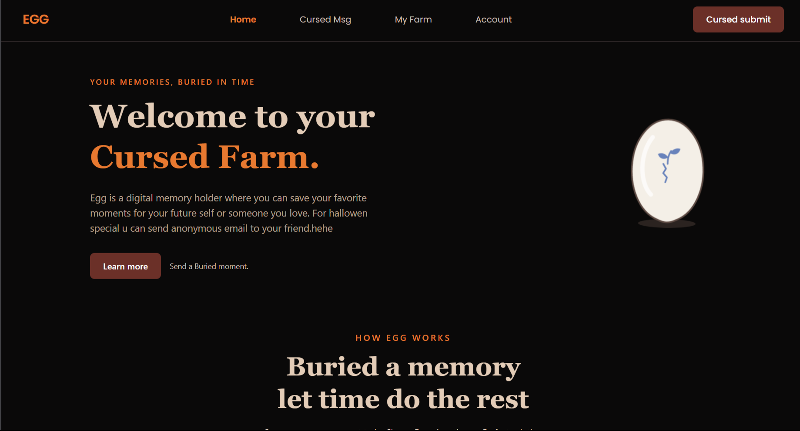
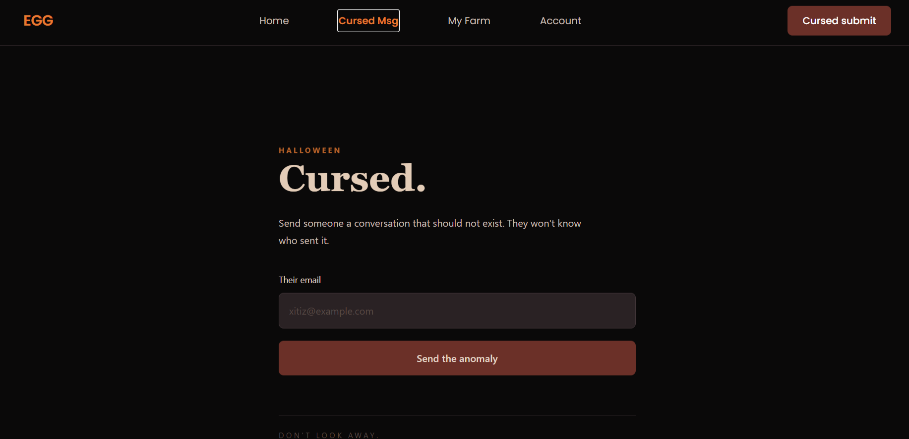
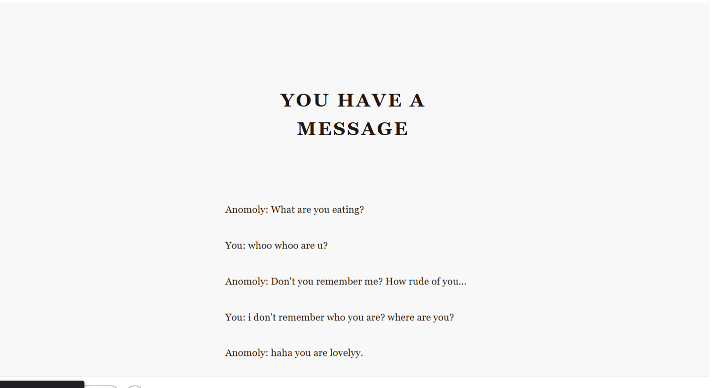
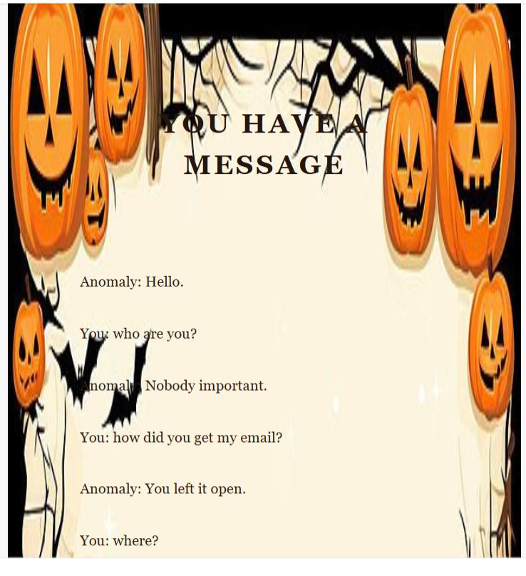

# EGG 
> Not the kind you are thinking..itss a different type of EGG
EGG is a Halloween special annomoly email sender lol . and an memory holder for your future time.  

Send you friend some scary conv and scared him/her

## Feature
- being able to send scary conv text to your friend 
some more feature

(IDK why the background that i set didnot came will try to fix this now)

 (now it look ahh)

- create personal memory eggs for future hallowen wish
- Lock some unforgetfull memory untill choosen date to send ypour friend that scary conv again 
- Storing text-based memories
- smooth page transitions and animations 

# why EGG was created and where did we get the inspiration ?
 The EGG is created because to help user not forget there loved memory , scary and help them to remember there memory hehe and help them to not forget their scary moment in their life so they can tell their kids.
 we got the inspiration to make EGG from a cartoon called doremon where in that ep we saw a time capsule used to hold memory it was physical capsule and from there we got the idea to create this wonderfull digital time capsule idea called EGG

## Why choose name EGG ?
Well it doesn't have any special reason it just egg looked like the closest thing from the cartoon and it was unique that's why 

# what are the Tech Stack used to make this
## Frontend
- React
- Typescript
- vite
- TailwindCss
- Motion (for animation)

## Backend
- python
- FastApI
- pydantic

## Database 
- MySQL 

# Devlopment tools 
- Git 
- Github
# Api
- Resend Api key
 
# To run EGG
- Clone the repository using 
> git clone https://github.com/XItizmgr/Egg.git
- Move into the root folder
> cd Egg
- Frontend Setup
> cd frontend
> npm install (install the dependencies)
> npm run dev (start the frontend server)
- Backend setup
> cd backend
> python -m venv venv (creating virtual environment)
> .\venv\Scripts\Activate (activating that virtual environment )
> pip install -r requirements.txt (installing the dependencies)
> uvicorn app.main:app --reload (starting the server)

# Things to Note 
This is not the complete project . we have many thing to add in EGG. This is just v1 of EGG 
Some of the future plan for egg
- Making EGG 3d 
- Adding three.js to make all of your egg 3d 
- and many more

# Ai Usages 
- The svg for egg  and its shadow are ai generated (we will remove it and add 3d egg soon )
- the scary text idea is mine but the conv writing is direvtly copy paste from ai
- Website desing is pretty simple (cuz i don't think much and just used some ai slop website design)